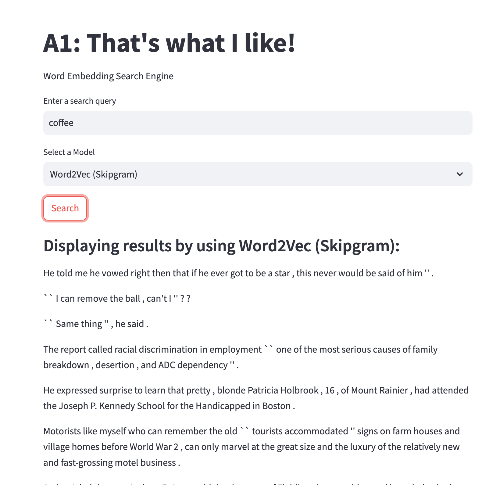
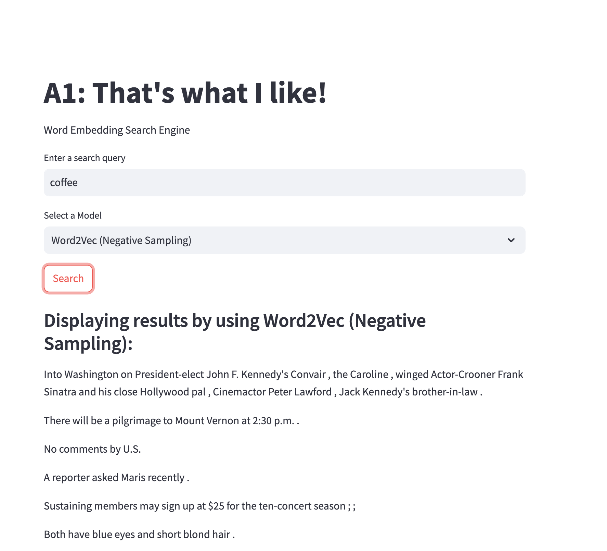
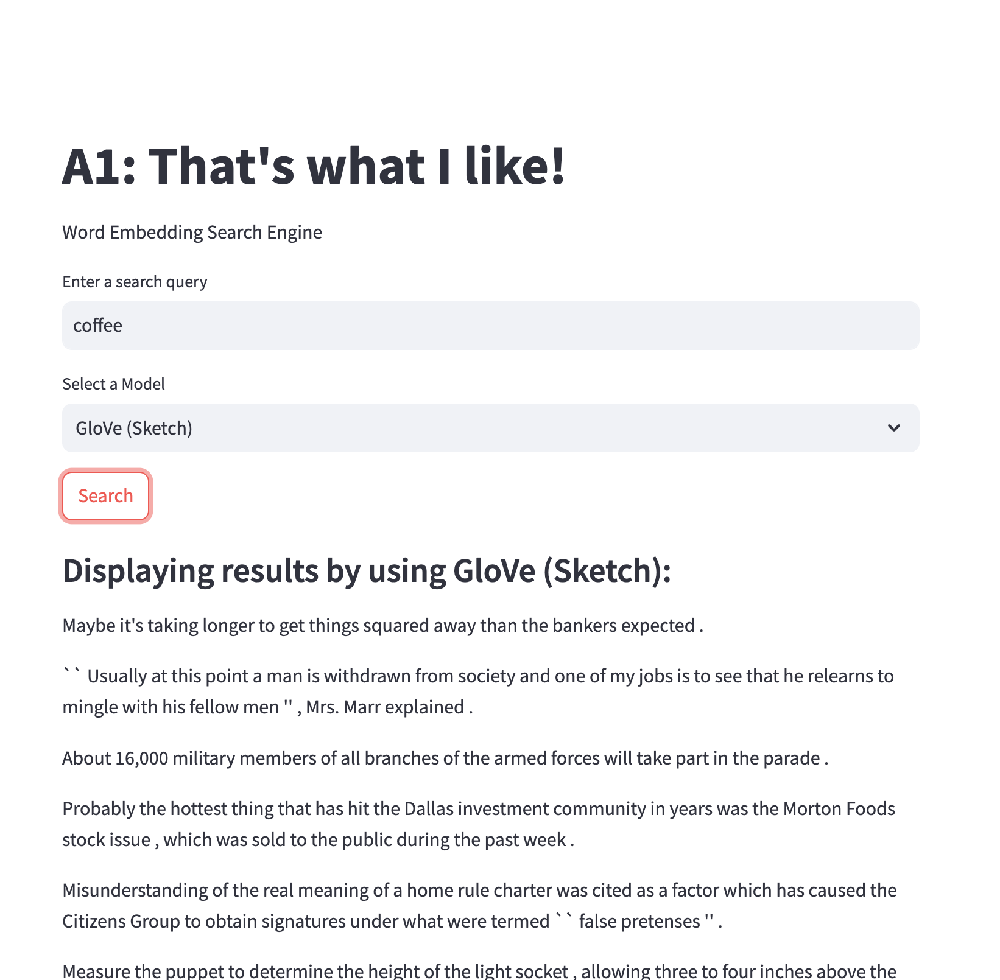
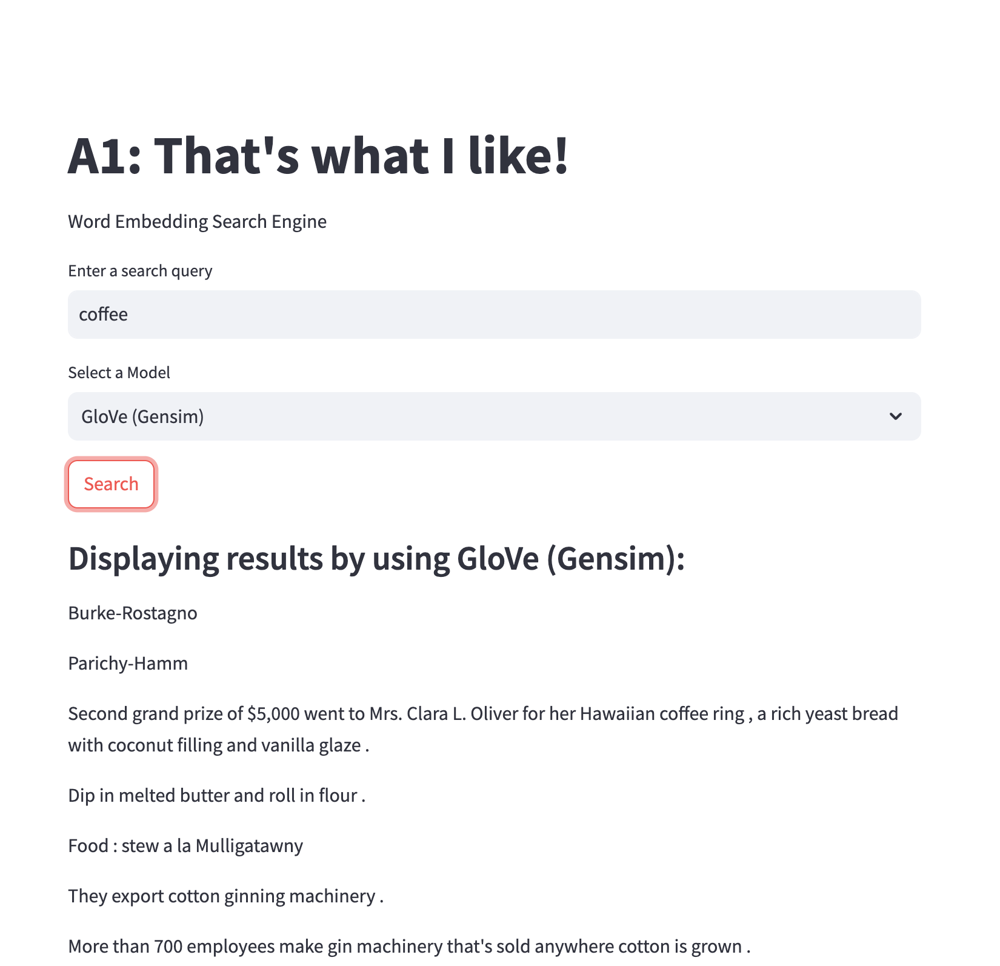

# NLP-A1-That-s-What-I-LIKE
### Assignment 1: That’s What I LIKE
### AT82.05 Artificial Intelligence: Natural Language Understanding (NLU)

## GitHubLink:
-  https://github.com/Nyeinchanaung/NLP-A1-That-s-What-I-LIKE-st125553

## Content
- [Student Information](#student-information)
- [Files Structure](#files-structure)
- [How to run](#how-to-run)
- [Dataset](#dataset)
- [Evaluation](#evaluation)

## Student Information
 - Name     : Nyein Chan Aung
 - ID       : st125553
 - Program  : DSAI

## Files Structure
1) The Jupytor notebook files
- 01-Word2VecSkipgram.ipynb
- 02-Word2VecNegSampling.ipynb
- 03-GloveScratch.ipynb
- 04-GloVeGensim.ipynb
2) `data` folder(training and testing data file)
- word-test-semantic.txt for semantic data
- word-test-syntatic.txt for syntatic data
- wordsim353_sim_rel > wordsim_similarity_goldstandard.txt for similarity testing
3) 'app' folder  
- app.py (streamlit)
- `models` folder which contains four model exports and their metadata files.
 
## How to run
 - Clone the repo
 - Open the project
 - Open the `app` folder
 - `streamlit run app.py`
 - app should be up and run on `http://localhost:8501/`

## Dataset
- `brown` dataset (category 'news') from `nltk`.
- `epho` 1000

 ## Evaluation

### Model Comparison and Analysis

| Model             | Window Size | Training Loss | Training Time | Semantic Accuracy | Syntactic Accuracy | Similarity (Correlation Score) |
|-------------------|-------------|---------------|---------------|--------------------|-------------------|-------------------|
| Skipgram          | 2     | 9.32      | 10 min 18 sec       | 0.00%            | 0.00%           | 0.08   |
| Skipgram (NEG)    | 2     | 1.23       | 12 min 23 sec       | 0.00%            | 0.00%           | 0.14   |
| Glove             | 2     | 0.31      | 1 min 12 sec       | 0.00%            | 0.00%           | 0.02   |
| Glove (Gensim)    | - | -       | -       | 53%            | 55%           | 0.58   |

### Report
#### Observations
- Training Loss: 
Skipgram (Negative Sampling) achieved a significantly lower training loss (1.23) compared to Skipgram (9.32), showing improved learning efficiency with negative sampling.
GloVe had the lowest loss at 0.31.
 
- Training Time: 
Skipgram models took over 10 minutes, while GloVe training was the fastest at just over 1 minute.
 
- Semantic and Syntactic Accuracy: 
Only GloVe (Gensim) showed significant semantic and syntactic accuracy, with 53% and 55%, respectively.
Custom Skipgram and GloVe implementations reported 0% in both categories, indicating limitations in training or dataset coverage for these experiments.
 
- Similarity Correlation: 
GloVe (Gensim) had the highest similarity correlation (0.58) with human-labeled data, indicating the best performance in capturing word associations.
Skipgram (NEG) had a moderate score of 0.14, while Skipgram and GloVe scored poorly at 0.08 and 0.02, respectively.
 

##### Similarity test report

| Model             | Skipgram | NEG    |  GloVe   | GloVe (gensim)| Y true |
|-------------------|----------|---------|---------|---------------|--------|
| Spearman correlation | 0.08  | 0.14    | 0.0205  | 0.5800        |1       |
| MSE               | 31.6928  | 29.7797 | 32.2789 | 27.8081       |0       |

- Spearman Correlation:  
 Measures how well the predicted similarities align with human-judged similarities.
  
- MSE (Mean Squared Error):  
Measures prediction error against human judgment.
 

### Webapp Screenshot

